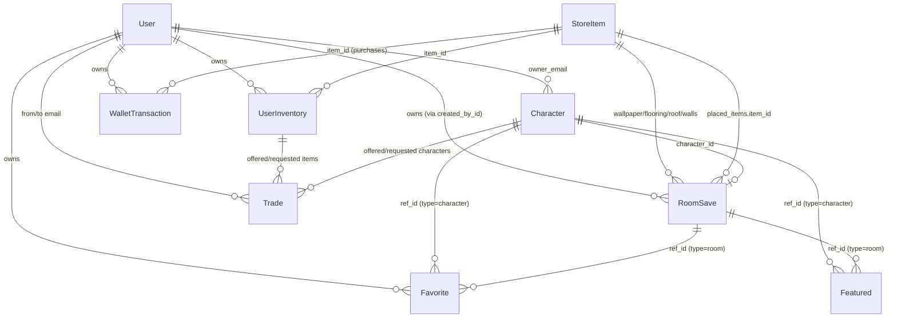

# Base44 Project Analysis — Malcion Homesteads

> **App name (UI):** Kingdoms of Malcion / Malcion Homesteads  
> **Platform:** [Base44](https://base44.com) (BaaS) with `@base44/sdk`  
> **Stack:** React 18, Vite 6, React Router 6, TanStack Query 5, Tailwind CSS, shadcn/ui (Radix)

This document describes the full architecture of the imported Base44 project. No application code was modified during this analysis.

---

## Table of Contents

1. [High-Level Architecture](#1-high-level-architecture)
2. [Database Schemas / Entities](#2-database-schemas--entities)
3. [Entity Relationships](#3-entity-relationships)
4. [API Structure](#4-api-structure)
5. [Frontend Architecture](#5-frontend-architecture)
6. [Business Logic](#6-business-logic)
7. [Folder Structure](#7-folder-structure)
8. [Reusable Components](#8-reusable-components)
9. [Notable Gaps & Implementation Notes](#9-notable-gaps--implementation-notes)

---

## 1. High-Level Architecture

```
┌─────────────────────────────────────────────────────────────────┐
│                     React SPA (Vite + React)                    │
│  Pages → Components → Custom Hooks → base44Client (@base44/sdk) │
└────────────────────────────┬────────────────────────────────────┘
                             │ HTTPS (proxied in dev via vite plugin)
┌────────────────────────────▼────────────────────────────────────┐
│                    Base44 Backend (hosted)                      │
│  • Entity CRUD (RoomSave, StoreItem, Character, …)              │
│  • Auth (email/password, Google OAuth, OTP)                       │
│  • File uploads (integrations.Core.UploadFile)                  │
│  • Per-user row scoping (created_by_id) + admin role on User      │
└─────────────────────────────────────────────────────────────────┘
```

**Schema definitions** live locally in `base44/entities/*.jsonc` and sync with the Base44 Builder. The app ID is `6a19ae49cc9d7b1ca2083a0f` (`base44/.app.jsonc`).

**Important naming clarification:** There are **no separate `Room` or `House` entities**. Both indoor rooms and outdoor houses are stored as `RoomSave` records distinguished by `room_type: "indoor" | "outdoor"`. The UI labels outdoor saves as "House" and indoor saves as "Room".

**Wallet:** There is **no `Wallet` entity**. Coin balance is computed client-side as the sum of `WalletTransaction` ledger entries.

---

## 2. Database Schemas / Entities

All entities are defined in `base44/entities/`. Base44 automatically adds system fields (e.g. `id`, `created_date`, `updated_date`, `created_by_id`) at runtime.

### 2.1 User

**File:** `base44/entities/User.jsonc`

| Field | Type | Description |
|-------|------|-------------|
| `role` | `enum: admin \| user` | Access control; `admin` unlocks Mod Panel |

**Usage:** Extended profile on top of Base44 auth user (`base44.auth.me()` returns email, full_name, role, etc.). Listed by admins for character assignment and coin management.

---

### 2.2 RoomSave (Room + House)

**File:** `base44/entities/RoomSave.jsonc`  
**Conceptual aliases:** "Room" = `room_type: indoor`, "House" = `room_type: outdoor`

| Field | Type | Description |
|-------|------|-------------|
| `name` | string | **Required.** Display name of the save slot |
| `room_type` | `indoor \| outdoor` | **Required.** Distinguishes room vs house |
| `character_id` | string | FK → `Character.id` placed in the scene |
| `active_sprite_index` | number (default 0) | Which sprite pose to show (schema field; see §6) |
| `sprite_position` | `{ x, y }` | Character sprite coordinates on canvas |
| `wallpaper_item_id` | string | FK → `StoreItem.id` (indoor wallpaper) |
| `flooring_item_id` | string | FK → `StoreItem.id` (indoor flooring) |
| `roof_item_id` | string | FK → `StoreItem.id` (outdoor roof) |
| `exterior_wall_item_id` | string | FK → `StoreItem.id` (outdoor walls) |
| `placed_items` | array | Draggable furniture/decor placements |

**`placed_items[]` sub-object:**

| Field | Type | Description |
|-------|------|-------------|
| `item_id` | string | FK → `StoreItem.id` |
| `x`, `y` | number | Canvas position (700×500 coordinate space) |
| `width`, `height` | number | Render size (defaults from StoreItem) |
| `z_index` | number | Layer ordering |

---

### 2.3 StoreItem

**File:** `base44/entities/StoreItem.jsonc`

| Field | Type | Description |
|-------|------|-------------|
| `name` | string | **Required.** |
| `description` | string | Optional flavor text |
| `image_url` | string | Item/sprite image URL |
| `price` | number | **Required.** Cost in coins |
| `category` | enum | See categories below |
| `placement_type` | `draggable \| clickable` | How item is used in room editor |
| `room_type` | `indoor \| outdoor \| both` | Where item can be placed/applied |
| `is_limited` | boolean | Limited-time store item |
| `limited_until` | date | Expiry for limited items |
| `default_width`, `default_height` | number | Default placement size (80×80) |

**Categories:**

| Category | Placement | Room context |
|----------|-----------|--------------|
| `furniture` | draggable | indoor/outdoor |
| `decoration` | draggable | both |
| `wallpaper` | clickable | indoor |
| `flooring` | clickable | indoor |
| `roof` | clickable | outdoor |
| `exterior_wall` | clickable | outdoor |
| `window`, `door` | clickable | outdoor |
| `garden` | draggable | outdoor |
| `sprite_slot` | consumable slot | unlocks character sprite slots |
| `room_slot` | consumable slot | unlocks extra indoor rooms |
| `house_slot` | consumable slot | unlocks extra outdoor houses |
| `limited` | varies | flagged limited items |

---

### 2.4 UserInventory

**File:** `base44/entities/UserInventory.jsonc`

| Field | Type | Description |
|-------|------|-------------|
| `item_id` | string | **Required.** FK → `StoreItem.id` |
| `quantity` | number (default 1) | Total owned count |
| `activated_quantity` | number (default 0) | Permanently consumed slot items |
| `purchased_at` | datetime | Purchase timestamp |

**Slot item lifecycle:** Purchased slots have `quantity` incremented. When a player activates a slot (`room_slot`, `house_slot`, `sprite_slot`), `activated_quantity` increments. Unused slots = `quantity - activated_quantity` (tradeable); activated slots are permanent.

---

### 2.5 Character

**File:** `base44/entities/Character.jsonc`

| Field | Type | Description |
|-------|------|-------------|
| `name` | string | **Required.** |
| `description` | string | Bio/backstory |
| `thumbnail_url` | string | Card/avatar image |
| `owner_email` | string | Owning player's email |
| `sprites` | array | Pose images for room placement |
| `max_sprite_slots` | number (default 1) | Max uploadable sprites |
| `active_sprite_index` | number (default 0) | Default pose index |

**`sprites[]` sub-object:**

| Field | Type |
|-------|------|
| `url` | string (image URL) |
| `label` | string (e.g. "Happy pose") |

Characters are **created by moderators** (not self-service registration). Players edit name, description, and manage sprites.

---

### 2.6 Featured

**File:** `base44/entities/Featured.jsonc`

| Field | Type | Description |
|-------|------|-------------|
| `type` | `room \| character` | **Required.** Polymorphic target type |
| `ref_id` | string | **Required.** FK → `RoomSave.id` or `Character.id` |
| `owner_email` | string | Original owner's email |
| `owner_username` | string | Display name for showcase |
| `note` | string | Moderator caption |
| `active` | boolean (default true) | Visible in public showcase |
| `featured_order` | number (default 0) | Sort order (lower = first) |

---

### 2.7 Favorite

**File:** `base44/entities/Favorite.jsonc`  
*(Entity name is singular `Favorite`, not `Favorites`)*

| Field | Type | Description |
|-------|------|-------------|
| `ref_type` | `room \| character` | **Required.** |
| `ref_id` | string | **Required.** FK → `RoomSave.id` or `Character.id` |

Per-user bookmarks. Scoped to the authenticated user by Base44.

---

### 2.8 WalletTransaction

**File:** `base44/entities/WalletTransaction.jsonc`  
*(This is the wallet system — no separate Wallet table)*

| Field | Type | Description |
|-------|------|-------------|
| `amount` | number | **Required.** Positive = credit, negative = debit |
| `type` | enum | `purchase`, `credit`, `refund`, `mod_adjustment` |
| `description` | string | Human-readable note |
| `item_id` | string | Optional FK → `StoreItem.id` (purchases) |
| `target_user_email` | string | For mod adjustments targeting another user |

**Balance** = `SUM(amount)` over the user's own transactions + mod adjustments where `target_user_email` matches.

---

### 2.9 Trade

**File:** `base44/entities/Trade.jsonc`

| Field | Type | Description |
|-------|------|-------------|
| `status` | `pending \| accepted \| declined \| cancelled` | **Required.** |
| `from_user_email` | string | **Required.** Offer creator |
| `from_user_name` | string | Display name |
| `to_user_email` | string | **Required.** Recipient |
| `offered_items` | array | Items offered |
| `offered_character_ids` | string[] | Characters offered |
| `requested_items` | array | Items requested |
| `requested_character_ids` | string[] | Characters requested |
| `message` | string | Optional note |

**`offered_items[]` / `requested_items[]` sub-object:**

| Field | Type |
|-------|------|
| `inventory_id` | string (FK → `UserInventory.id`) |
| `item_id` | string (FK → `StoreItem.id`) |
| `item_name` | string (denormalized) |
| `quantity` | number |

---

## 3. Entity Relationships



### Relationship Summary

| From | To | Join / Key |
|------|-----|------------|
| `UserInventory` | `StoreItem` | `item_id` |
| `RoomSave` | `Character` | `character_id` |
| `RoomSave` | `StoreItem` | `*_item_id` fields + `placed_items[].item_id` |
| `Featured` | `RoomSave` or `Character` | `type` + `ref_id` (polymorphic) |
| `Favorite` | `RoomSave` or `Character` | `ref_type` + `ref_id` (polymorphic) |
| `Trade` | `UserInventory` | `inventory_id` in item arrays |
| `Trade` | `Character` | `*_character_ids` arrays |
| `Trade` | `User` | `from_user_email`, `to_user_email` |
| `Character` | `User` | `owner_email` |
| `WalletTransaction` | `StoreItem` | `item_id` (optional) |
| `WalletTransaction` | `User` | `target_user_email` (mod adjustments) |

---

## 4. API Structure

All API access goes through a single client:

```js
// src/api/base44Client.js
import { createClient } from '@base44/sdk';
export const base44 = createClient({ appId, token, functionsVersion, appBaseUrl, requiresAuth: false });
```

Configuration is resolved from URL params, localStorage, or env vars (`VITE_BASE44_APP_ID`, `VITE_BASE44_APP_BASE_URL`) via `src/lib/app-params.js`.

### 4.1 Entity APIs

Standard CRUD pattern for every entity:

| Method | Signature | Purpose |
|--------|-----------|---------|
| `list` | `.list(sort?, limit?)` | List records (user-scoped or all for admins) |
| `filter` | `.filter(query, sort?, limit?)` | Query by field equality |
| `create` | `.create(data)` | Insert new record |
| `update` | `.update(id, data)` | Partial update |
| `delete` | `.delete(id)` | Remove record |
| `subscribe` | `.subscribe(callback)` | Real-time change listener (used by Wallet) |

#### Entity API Usage Map

| Entity | Primary Consumers | Operations Used |
|--------|-------------------|-----------------|
| **RoomSave** | `Rooms`, `RoomEditor`, `Home`, `Showcase`, `Favorites`, admin | list, filter, create, update, delete |
| **StoreItem** | `Store`, `RoomEditor`, `InventoryPanel`, admin | list, create, update, delete |
| **UserInventory** | `useInventory`, `Store`, `Inventory`, `CreateTradeDialog`, admin | list, create, update, delete, filter |
| **Character** | `Characters`, `RoomEditor`, `Showcase`, `Favorites`, trade, admin | list, filter, create, update, delete |
| **Featured** | `Showcase`, `Home`, admin | list, filter, create, update, delete |
| **Favorite** | `useFavorites`, `FavoriteButton` | list, create, delete |
| **WalletTransaction** | `useWallet`, `Store`, `Wallet`, admin | list, filter, create, subscribe |
| **Trade** | `Trade`, `CreateTradeDialog`, admin | list, create, update |
| **User** | admin tabs | list |

### 4.2 Auth APIs

**Client:** `base44.auth.*`  
**Context:** `src/lib/AuthContext.jsx`

| API | Used In | Purpose |
|-----|---------|---------|
| `me()` | Throughout | Get current authenticated user |
| `loginViaEmailPassword(email, password)` | `Login` | Email login |
| `register({ email, password })` | `Register` | New account |
| `verifyOtp({ email, otpCode })` | `Register` | OTP verification |
| `resendOtp(email)` | `Register` | Resend OTP |
| `loginWithProvider("google", redirect)` | `Login`, `Register` | Google OAuth |
| `logout(redirectUrl?)` | `AuthContext` | Sign out |
| `redirectToLogin(url)` | `AuthContext` | Redirect to login |
| `resetPasswordRequest(email)` | `ForgotPassword` | Request reset email |
| `resetPassword({ resetToken, newPassword })` | `ResetPassword` | Complete reset |
| `setToken(token)` | `Register` | Store access token after OTP |

**Public settings API** (raw axios, not SDK):

```
GET /api/apps/public/prod/public-settings/by-id/{appId}
```

Used at startup to detect `auth_required` and `user_not_registered` states.

### 4.3 Integration APIs

| API | Used In | Purpose |
|-----|---------|---------|
| `base44.integrations.Core.UploadFile({ file })` | `SpriteManager`, `CharacterForm`, admin character/store tabs | Upload images; returns `{ file_url }` |

### 4.4 API Call Flow Examples

**Purchase item (Store):**
```
1. useWallet.spend → WalletTransaction.create({ amount: -price, type: "purchase", item_id })
2. useInventory.addItem → UserInventory.create/update (quantity++)
```

**Save room (RoomEditor):**
```
RoomSave.update(roomId, { placed_items, character_id, sprite_position, wallpaper_item_id, ... })
```

**Feature a room (Mod Panel):**
```
Featured.create({ type: "room", ref_id, owner_email, owner_username, note, active, featured_order })
```

---

## 5. Frontend Architecture

### 5.1 Routing (`src/App.jsx`)

| Route | Page | Layout | Auth |
|-------|------|--------|------|
| `/login` | Login | — | Public |
| `/register` | Register | — | Public |
| `/forgot-password` | ForgotPassword | — | Public |
| `/reset-password` | ResetPassword | — | Public |
| `/` | Home | AppLayout | Protected |
| `/characters` | Characters | AppLayout | Protected |
| `/rooms` | Rooms | AppLayout | Protected |
| `/rooms/:id/edit` | RoomEditor | Full-screen (no sidebar) | Protected |
| `/showcase` | Showcase | AppLayout | Protected |
| `/store` | Store | AppLayout | Protected |
| `/wallet` | Wallet | AppLayout | Protected |
| `/inventory` | Inventory | AppLayout | Protected |
| `/trade` | Trade | AppLayout | Protected |
| `/favorites` | Favorites | AppLayout | Protected |
| `/mod` | ModPanel | AppLayout | Protected (admin only) |
| `*` | PageNotFound | — | — |

**Guards:** `ProtectedRoute` wraps authenticated routes. `ModPanel` additionally checks `user.role === "admin"`.

### 5.2 State Management

| Layer | Technology | Responsibility |
|-------|------------|----------------|
| Server state | TanStack Query (`@tanstack/react-query`) | Entity fetching, caching, mutations |
| Auth state | React Context (`AuthContext`) | User session, app public settings |
| Local UI state | `useState` in pages/components | Forms, dialogs, editor canvas state |
| Custom hooks | `useInventory`, `useWallet`, `useFavorites` | Domain logic + query/mutation wrappers |

Query client: `src/lib/query-client.js`

### 5.3 Layout

```
AppLayout
├── Sidebar (desktop, md+)
├── MobileNav (bottom, <md)
└── <Outlet /> (page content)

RoomEditor (exception: full-screen, no AppLayout chrome)
```

### 5.4 Feature Modules

#### Room Editor (`/rooms/:id/edit`)

**Files:** `src/pages/RoomEditor.jsx`, `src/components/room-editor/*`

```
RoomEditor
├── EditorToolbar        — back link, save button, unsaved indicator
├── RoomCanvas           — 700×500 scaled canvas, drag/drop, z-order
├── CharacterPicker      — select character with sprites
└── InventoryPanel       — place items / apply styles (desktop sidebar or mobile sheet)
```

**Canvas coordinate system:** Fixed 700×500 px space, scaled via CSS `transform: scale()` to fit container. Indoor uses a starter room PNG + wallpaper/flooring overlays. Outdoor uses CSS gradients + roof/wall image overlays.

#### Room Preview (read-only)

**File:** `src/components/room-editor/RoomPreview.jsx`

Mirrors `RoomCanvas` rendering without interaction. Used in Showcase, Favorites, and detail modals.

#### Inventory Panel (in-editor)

**File:** `src/components/room-editor/InventoryPanel.jsx`

Two tabs:
- **Items** — draggable furniture/decor filtered by room type and ownership availability
- **Styles** — clickable wallpaper/flooring (indoor) or roof/exterior_wall/window/door (outdoor)

#### Store (`/store`)

**Files:** `src/pages/Store.jsx`, `src/components/store/StoreItemCard.jsx`

Category tabs filter `StoreItem` list. Purchase deducts coins then adds to inventory.

#### Characters (`/characters`)

**Files:** `src/pages/Characters.jsx`, `src/components/characters/*`

Grid of owned characters → detail dialog with edit form + `SpriteManager`.

#### Inventory Page (`/inventory`)

Separate from editor panel. Shows all owned store items + characters. Slot items can be activated here.

#### Wallet (`/wallet`)

Balance card + transaction history from `useWallet`.

#### Showcase (`/showcase`)

Public gallery of moderator-curated `Featured` rooms and characters with `RoomPreview` thumbnails and `FavoriteButton`.

#### Favorites (`/favorites`)

User's `Favorite` records resolved against full room/character lists.

#### Trading (`/trade`)

Incoming / outgoing / history tabs. `CreateTradeDialog` for new offers. `TradeOfferCard` for display and actions.

#### Mod Panel (`/mod`)

Admin-only tabs: Featured, All Rooms, All Characters, Coins, Store, Inventory, Trade Logs.

### 5.5 Styling & UI Kit

- **Tailwind CSS** with custom theme in `tailwind.config.js`
- **shadcn/ui** components in `src/components/ui/` (Radix primitives)
- **Icons:** lucide-react
- **Toasts:** sonner + shadcn toaster
- **Fonts:** `font-heading` utility class for display headings

---

## 6. Business Logic

### 6.1 How Room Save Works

1. **Create** (`Rooms.jsx`): `RoomSave.create({ name, room_type, placed_items: [] })`
2. **Slot limits:** Player starts with 1 indoor + 1 outdoor slot. Extra slots come from activated `room_slot` / `house_slot` inventory items.
3. **Load** (`RoomEditor.jsx`): `RoomSave.filter({ id: roomId })` → hydrate local state
4. **Edit:** Local React state tracks `placedItems`, style IDs, `characterId`, `spritePosition`
5. **Save:** `RoomSave.update(roomId, { placed_items, character_id, sprite_position, wallpaper_item_id, flooring_item_id, roof_item_id, exterior_wall_item_id })`
6. **Delete:** `RoomSave.delete(id)` from Rooms page or admin

**Not persisted on save (currently):** `active_sprite_index` on RoomSave — the editor uses the Character's `active_sprite_index` instead. RoomPreview checks `room.active_sprite_index` first, then falls back to character's index.

### 6.2 How Inventory Works

```
Purchase (Store)
  → WalletTransaction (debit)
  → UserInventory.quantity++

Placement (Room Editor)
  → Does NOT decrement inventory quantity
  → Availability = quantity - count of same item_id in placed_items

Slot Activation (Rooms / Inventory)
  → UserInventory.activated_quantity++
  → Permanently unlocks room/house/sprite capacity
  → Unused slots (quantity - activated_quantity) remain tradeable

Slot Limits (useInventory.js)
  maxIndoorRooms  = 1 + activated room_slot items
  maxOutdoorRooms = 1 + activated house_slot items
  maxSpriteSlots  = 1 + activated sprite_slot items (per character via max_sprite_slots set by mod)
```

### 6.3 How Furniture Placement Works

1. Player clicks item in `InventoryPanel` (Items tab)
2. `handlePlaceItem` appends to `placed_items` with random position near center, default size from `StoreItem`, incrementing `z_index`
3. `RoomCanvas` renders each placement as absolutely positioned `` or placeholder
4. **Drag:** mouse/touch updates `x`, `y` within canvas bounds
5. **Select:** shows delete + z-order (bring forward / send backward) controls
6. **Availability:** same `item_id` can only be placed up to `inventory.quantity` times

**Clickable styles** (Styles tab): set `wallpaperId`, `flooringId`, `roofId`, or `exteriorWallId` state — applied as CSS background overlays, not as placed_items entries.

### 6.4 How Sprites Work

**On Character:**
- Moderator sets `max_sprite_slots` at creation
- Player uploads images via `SpriteManager` → `UploadFile` → append to `sprites[]`
- Player sets `active_sprite_index` (star button) for default pose
- Slot limit enforced: `sprites.length < max_sprite_slots`

**In Room:**
- `CharacterPicker` lists characters with at least one sprite
- Selected character's active sprite renders on canvas at `sprite_position`
- Sprite is draggable independently of furniture
- Sprite uses character's `sprites[active_sprite_index].url`

**Sprite slot upgrades:** Purchasing `sprite_slot` store items and activating them increases room/house capacity logic in `useInventory`, but per-character `max_sprite_slots` is set by moderators (not auto-incremented from sprite_slot purchases in current code).

### 6.5 How Featured Works

1. **Creation (admin only):** From All Rooms or All Characters tab → `AddToFeaturedDialog`
2. **Record:** `Featured.create({ type, ref_id, owner_email, owner_username, note, active: true, featured_order })`
3. **Display:** `Showcase` and `Home` query `Featured.filter({ active: true }, "featured_order")`
4. **Resolution:** `ref_id` joined client-side against `RoomSave.list()` or `Character.list()`
5. **Management:** `FeaturedManagerTab` can toggle `active`, delete entries, reorder via `featured_order`

### 6.6 How Favorites Work

1. **Toggle:** `FavoriteButton` → `useFavorites.toggleFavorite`
   - If exists: `Favorite.delete(id)`
   - Else: `Favorite.create({ ref_type, ref_id })`
2. **List:** `Favorites` page loads all favorites, filters rooms/characters by `ref_id`
3. **Scope:** Per authenticated user (Base44 row ownership)
4. **UI placement:** Heart button on Showcase cards and Favorites modals

### 6.7 How Trading Works

1. **Create offer:** `CreateTradeDialog` → `Trade.create({ status: "pending", from/to emails, offered_*, requested_*, message })`
2. **View:** Filter trades by current user email into incoming/outgoing/history
3. **Actions:** Update `status` to `accepted`, `declined`, or `cancelled`
4. **Offered side:** Player selects from own `UserInventory` entries and owned `Character` records
5. **Requested side:** Currently character-only picker (other players' characters by email filter)

**Important:** Accepting a trade **only updates the status field**. There is **no server-side or client-side logic** to transfer `UserInventory` quantities or reassign `Character.owner_email`. This is a significant gap if full trade execution is expected.

---

## 7. Folder Structure

```
base44/
├── .app.jsonc                 # App ID
├── config.jsonc               # Build/serve commands for Base44 Builder
└── entities/                  # JSON Schema entity definitions (synced to platform)
    ├── Character.jsonc
    ├── Favorite.jsonc
    ├── Featured.jsonc
    ├── RoomSave.jsonc
    ├── StoreItem.jsonc
    ├── Trade.jsonc
    ├── User.jsonc
    ├── UserInventory.jsonc
    └── WalletTransaction.jsonc

src/
├── api/
│   └── base44Client.js        # SDK client singleton
├── components/
│   ├── admin/                 # Mod Panel tabs
│   ├── characters/            # CharacterCard, CharacterForm, SpriteManager
│   ├── layout/                # AppLayout, Sidebar, MobileNav
│   ├── room-editor/           # Canvas, Preview, InventoryPanel, Toolbar, CharacterPicker
│   ├── store/                 # StoreItemCard
│   ├── trade/                 # CreateTradeDialog, TradeOfferCard
│   ├── ui/                    # shadcn/ui primitives (~40 components)
│   ├── AuthLayout.jsx
│   ├── FavoriteButton.jsx
│   ├── GoogleIcon.jsx
│   ├── ProtectedRoute.jsx
│   ├── ScrollToTop.jsx
│   └── UserNotRegisteredError.jsx
├── hooks/
│   ├── useFavorites.js
│   ├── useInventory.js
│   ├── useWallet.js
│   └── use-mobile.jsx
├── lib/
│   ├── app-params.js          # Env/URL token resolution
│   ├── AuthContext.jsx
│   ├── query-client.js
│   ├── PageNotFound.jsx
│   └── utils.js               # cn() helper
├── pages/
│   ├── admin/
│   │   └── ModPanel.jsx
│   ├── Characters.jsx
│   ├── Favorites.jsx
│   ├── ForgotPassword.jsx
│   ├── Home.jsx
│   ├── Inventory.jsx
│   ├── Login.jsx
│   ├── Register.jsx
│   ├── ResetPassword.jsx
│   ├── RoomEditor.jsx
│   ├── Rooms.jsx
│   ├── Showcase.jsx
│   ├── Store.jsx
│   ├── Trade.jsx
│   └── Wallet.jsx
├── utils/
│   └── index.ts
├── App.jsx                    # Router + providers
├── main.jsx                   # Entry point
└── index.css                  # Global styles + Tailwind

# Root config
├── index.html
├── package.json
├── vite.config.js             # @base44/vite-plugin
├── tailwind.config.js
├── postcss.config.js
├── components.json            # shadcn config
├── eslint.config.js
└── jsconfig.json              # Path alias: @ → src/
```

---

## 8. Reusable Components

### 8.1 Domain Components (application-specific)

| Component | Path | Reuse |
|-----------|------|-------|
| `RoomCanvas` | `room-editor/RoomCanvas.jsx` | Interactive room renderer (editor) |
| `RoomPreview` | `room-editor/RoomPreview.jsx` | Read-only room renderer (showcase, favorites) |
| `InventoryPanel` | `room-editor/InventoryPanel.jsx` | In-editor item/style picker |
| `EditorToolbar` | `room-editor/EditorToolbar.jsx` | Room editor header bar |
| `CharacterPicker` | `room-editor/CharacterPicker.jsx` | Character dropdown for room |
| `StoreItemCard` | `store/StoreItemCard.jsx` | Store grid item |
| `CharacterCard` | `characters/CharacterCard.jsx` | Character grid card |
| `CharacterForm` | `characters/CharacterForm.jsx` | Character create/edit form |
| `SpriteManager` | `characters/SpriteManager.jsx` | Sprite upload/manage UI |
| `FavoriteButton` | `FavoriteButton.jsx` | Heart toggle (showcase, favorites) |
| `TradeOfferCard` | `trade/TradeOfferCard.jsx` | Trade display card |
| `CreateTradeDialog` | `trade/CreateTradeDialog.jsx` | New trade offer modal |
| `AddToFeaturedDialog` | `admin/AddToFeaturedDialog.jsx` | Admin feature curator dialog |
| `ProtectedRoute` | `ProtectedRoute.jsx` | Auth route guard |
| `AuthLayout` | `AuthLayout.jsx` | Login/register page wrapper |

### 8.2 Admin Tab Components

| Component | Purpose |
|-----------|---------|
| `FeaturedManagerTab` | Manage featured entries |
| `AllRoomsTab` | Browse/delete/feature all rooms |
| `AllCharactersTab` | CRUD, reassign, feature characters |
| `CoinsManagerTab` | Give/deduct coins per user |
| `StoreManagerTab` | CRUD store catalog |
| `InventoryManagerTab` | Manage any user's inventory |
| `TradeLogsTab` | Read-only trade history |

### 8.3 Layout Components

| Component | Purpose |
|-----------|---------|
| `AppLayout` | Sidebar + main content + mobile nav |
| `Sidebar` | Desktop navigation + admin link |
| `MobileNav` | Bottom tab bar (mobile) |

### 8.4 Custom Hooks

| Hook | Exports | Used By |
|------|---------|---------|
| `useInventory` | inventory, slot limits, addItem, activateSlot, ownsItem, getQuantity | Store, Rooms, RoomEditor, Inventory, Trade |
| `useWallet` | balance, transactions, spend, addFunds | Store, Wallet, Home |
| `useFavorites` | favorites, isFavorited, toggleFavorite | FavoriteButton, Favorites |
| `useAuth` | user, isAuthenticated, logout, auth errors | ProtectedRoute, Sidebar, ModPanel |

### 8.5 UI Primitives (`src/components/ui/`)

shadcn/ui components built on Radix UI. Commonly used across the app:

`button`, `card`, `dialog`, `input`, `label`, `select`, `tabs`, `badge`, `scroll-area`, `sheet`, `textarea`, `toast`/`toaster`, `dropdown-menu`, `avatar`, `separator`, `skeleton`, `alert`, `alert-dialog`, `form`, `checkbox`, `switch`, `slider`, `table`, `tooltip`, `popover`, `drawer`, `pagination`, `carousel`, `command`, `calendar`, `chart`, `sidebar`, `resizable`, `collapsible`, `accordion`, `breadcrumb`, `context-menu`, `hover-card`, `menubar`, `navigation-menu`, `radio-group`, `toggle`, `toggle-group`, `aspect-ratio`, `input-otp`, `progress`, `sonner`

Utility: `cn()` from `src/lib/utils.js` (clsx + tailwind-merge).

---

## 9. Notable Gaps & Implementation Notes

| Area | Observation |
|------|-------------|
| **Trade execution** | Accept/decline only updates `Trade.status`. No inventory transfer or character ownership change. |
| **Room vs House entities** | Single `RoomSave` entity; UI terminology only. |
| **Wallet entity** | Ledger-only via `WalletTransaction`; balance computed in `useWallet`. |
| **Favorites entity name** | Schema is `Favorite` (singular). |
| **Room `active_sprite_index`** | Defined in schema but not saved by RoomEditor; character-level index used instead. |
| **CharacterPicker scope** | Uses `Character.list()` (all characters), not filtered to current user. |
| **Sprite slot purchases** | `sprite_slot` activation tracked in inventory but `max_sprite_slots` on Character is mod-set, not auto-linked. |
| **Placement vs inventory** | Placing furniture does not consume inventory quantity; only limits concurrent placements per owned count. |
| **Data scope** | Showcase/Favorites load up to 200 rooms/characters globally for join resolution. |
| **No custom backend functions** | All logic is client-side + Base44 entity CRUD; no `base44/functions` in repo. |

---

## Quick Reference: Entity → Page Map

| Entity | Primary Pages |
|--------|---------------|
| RoomSave | Rooms, RoomEditor, Home, Showcase, Favorites, ModPanel |
| StoreItem | Store, RoomEditor, Inventory, Showcase, Favorites, ModPanel |
| UserInventory | Store, Inventory, RoomEditor, Trade, ModPanel |
| Character | Characters, RoomEditor, Showcase, Favorites, Trade, ModPanel |
| Featured | Showcase, Home, ModPanel |
| Favorite | Favorites, Showcase (button) |
| WalletTransaction | Store, Wallet, ModPanel |
| Trade | Trade, ModPanel |
| User | ModPanel (admin) |

---

*Generated from static analysis of the Base44 project import. Last updated: July 5, 2026.*
